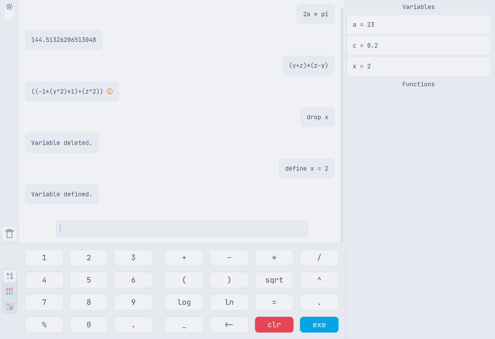

   

# lambda-calc-gui
The lambda-calc-GUI is based on the [lambda-calc engine](https://github.com/Emi-A-V/lambda-calc/tree/engine) and builds a user-friendly GUI on top of it.
The app is made with [wails library](https://wails.io/).

## Features
The GUI makes it easy to interact with the lambda-calc engine. The interface shows the history of the last calculations as well as all defined functions and variables.

   

## Usage
For learning how to use lambda-calc please refer to the [CLI implementation](https://github.com/Emi-A-V/lambda-calc/tree/main) of this project.
